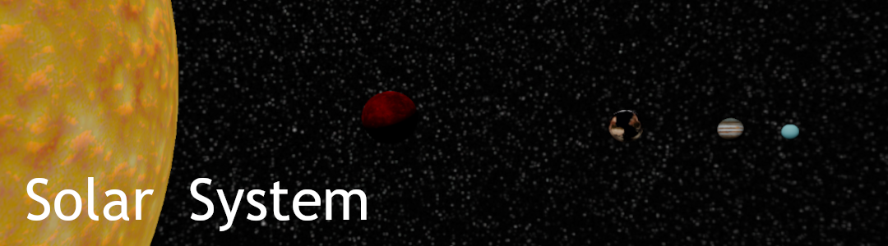

# Solar System <!-- omit in toc -->



## Contents <!-- omit in toc -->

- [Introduction](#introduction)
  - [Features](#features)
- [Setup](#setup)
- [Build](#build)
  - [Supported Platforms](#supported-platforms)
  - [Dependencies](#dependencies)
  - [Build with CMake](#build-with-cmake)
- [License](#license)

## Introduction 

This is a WIP project that aims to render solar system with all the planets orbiting around the sun.    

### Features
- PBR Workflow (Physically Based Rendering)
- Deferred & Forward Lighting
- MSAA (Multisample Anti Aliasing)
- Bloom
- Tone Mapping
- HDR Rendering
- .glTF Model Loader

## Setup 
 
Prerequisites: [git](https://git-scm.com/downloads) with [git large file storage (git-lfs)](https://docs.github.com/en/repositories/working-with-files/managing-large-files/installing-git-large-file-storage).

Clone the repo using the following command:

```
git clone https://github.com/oddStoneGames/SolarSystem.git
cd SolarSystem
```

## Build 
 
### Supported Platforms  
- Windows
- Linux

### Dependencies 
 
- Hardware with support for OpenGL 4.2 Core
- CMake v3.10+
- C++17 Compiler 
- On Linux, these [libraries](https://www.glfw.org/docs/latest/compile_guide.html) are required to build GLFW

### Build with CMake 
 
`Step 1.` Make a directory for the build files.

```
mkdir build
```

`Step 2.` Generate the project files.

```
cmake -S . -B ./build
```

`Step 3.` Build the project.

```
cmake --build build --config Release --target SolarSystem
```
`Step 4.` Run the executable SolarSystem which is located in the build or build/Release folder.


## LICENSE
[cc-by-nc]: http://creativecommons.org/licenses/by-nc/4.0/
[cc-by-nc-image]: https://licensebuttons.net/l/by-nc/4.0/88x31.png
[cc-by-nc-shield]: https://img.shields.io/badge/License-CC%20BY--NC%204.0-lightgrey.svg
[![CC BY-NC 4.0][cc-by-nc-image]][cc-by-nc]  
This work is licensed under a [Creative Commons Attribution-NonCommercial 4.0 International License][cc-by-nc].  

This project has some third-party dependencies, each of which may have independent licensing:

- [glad](https://glad.dav1d.de/): Multi-Language GL/GLES/EGL/GLX/WGL Loader-Generator based on the official specs.
- [glfw](https://github.com/glfw/glfw): A multi-platform library for OpenGL, OpenGL ES, Vulkan, window and input
- [glm](https://github.com/g-truc/glm): OpenGL Mathematics
- [dear imgui](https://github.com/ocornut/imgui): Immediate Mode Graphical User Interface
- [stb](https://github.com/nothings/stb): Single-file public domain (or MIT licensed) libraries
- [json](https://github.com/nlohmann/json): JSON for Modern C++

Models:
- [Star Of Sun](https://skfb.ly/onGxM) by ARCTIC  WOLVES™ is licensed under Creative Commons Attribution (http://creativecommons.org/licenses/by/4.0/).
- [Mercury](https://skfb.ly/IVBO) by Mieke Roth is licensed under Creative Commons Attribution (http://creativecommons.org/licenses/by/4.0/).
- [Venus v1.1](https://skfb.ly/LpyX) by uperesito is licensed under Creative Commons Attribution (http://creativecommons.org/licenses/by/4.0/).
- [Earth](https://skfb.ly/o7NMy) by Freemodels is licensed under Creative Commons Attribution (http://creativecommons.org/licenses/by/4.0/).
- [Mars](https://skfb.ly/IVF8) by Mieke Roth is licensed under Creative Commons Attribution (http://creativecommons.org/licenses/by/4.0/).
- [Jupiter - Free Downloadable Model](https://skfb.ly/6zW68) by murilo.kleine is licensed under Creative Commons Attribution (http://creativecommons.org/licenses/by/4.0/).
- [Saturn (planet)](https://skfb.ly/6yw9I) by SebastianSosnowski is licensed under Creative Commons Attribution (http://creativecommons.org/licenses/by/4.0/).
- [Uranus](https://skfb.ly/6THRF) by SebastianSosnowski is licensed under Creative Commons Attribution (http://creativecommons.org/licenses/by/4.0/).
- [Neptune](https://skfb.ly/6ABCv) by SebastianSosnowski is licensed under Creative Commons Attribution (http://creativecommons.org/licenses/by/4.0/).
- [Pluton v1.1](https://skfb.ly/6DuNY) by uperesito is licensed under Creative Commons Attribution (http://creativecommons.org/licenses/by/4.0/).